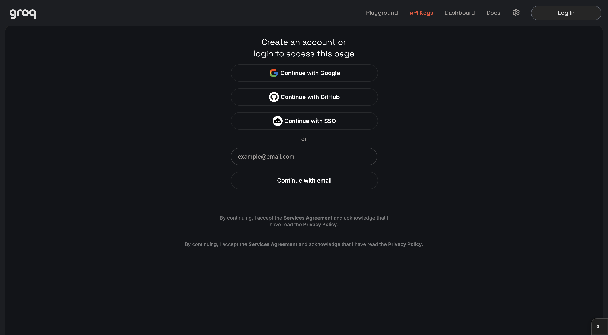
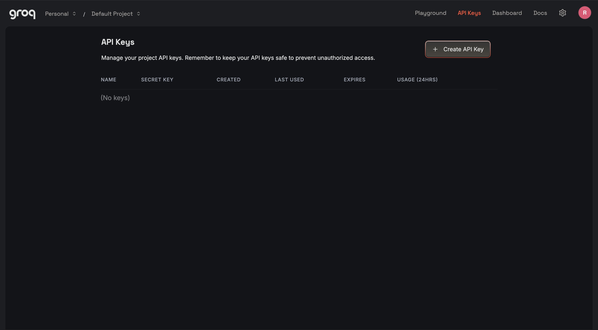
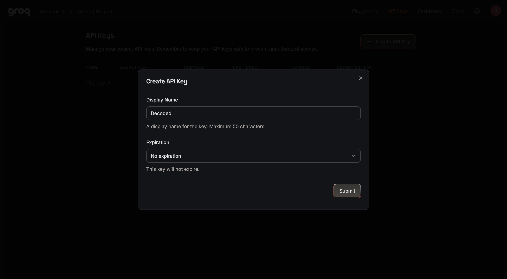
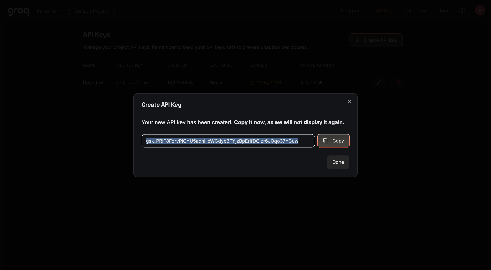
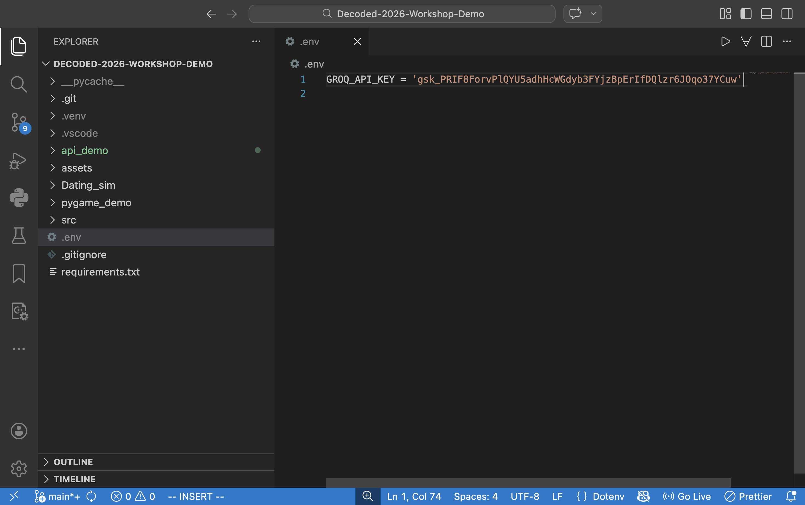

# API Demo

## What is an API?

API stands for <b>Application Programming Interface</b> Broadly speaking, an API is just some way for different programs to interact with each other. APIs serve as a useful intermediary for doing things that you don't feel like implementing or aren't capable of implementing.

Today, we will mostly be dealing with the Groq API. The Groq API allows for us to communicate with the AI provider Groq (not to be confused with Grok). Using this, we can call on a bunch of LLMs to do our bidding. We can do this without knowing anything about how LLMs work or the expensive hardware required to run an LLM.

To get access to most web APIs, we require some kind of verification, most commonly through an <b>API key</b>.

### Getting a Groq API Key

1. Head to [https://console.groq.com/keys](https://console.groq.com/keys)
   
2. Create an account with any of the provided methods.
   
3. Select "Create API Key" and give your API key a name and create!
   
4. After creating, make sure you copy the key
   
5. To save your API key, create a new file named ".env" in the project folder and type in the following:
   `GROQ_API = "[API_KEY]"`, replacing `[API_KEY]` with what you copied in the previous step
   

### A little bit more setup

We need to install some packages so that we can actually call the API easily. We will start by creating a virtual environmen and installing the necessary packages. Please make sure you are working in the right directory in your VSCode integrated terminal. You should see "Decoded-2026-Workshop-Demo" in your terminal.

On MacOS:

```bash
python3 -m venv .venv

source .venv/bin/activate

pip install -r requirements.txt
```

On Windows:

```powershell
py -m venv .venv

.venv\scripts\activate.bat

pip install -r requirements.txt
```

We then create a new Python file and import the necessary packages.

```python
from groq import Groq
from dotenv import load_dotenv
import os
```

## The actual code

The API can be thought of as just another function. It takes inputs and produces some output.
We start by loading in the API key into our code with the following lines:

```python
load_dotenv()
api_key = os.getenv("GROQ_API_KEY")
```

All this does is assign api_key to the API key we copied from Groq earlier. We do this so we can share our code with other people, without them being able to use our API key.

```python
system_prompt = """
INSERT YOUR SYSTEM PROMPT HERE
"""
```

The system prompt dictates what the AI does and how it does it. We can think of this like it's purpose or instructions that it will try to follow. You can write an entire narrative here and tell the AI to embody it, or even something as simple as "you are a maths teacher", so long as you give some system prompt it will show in the response.

```python
client = Groq(api_key = api_key)
```

Now we use the api_key we intialized earlier. We use this to create a "client", so that we can repeatedly call upon the AI relatively easily.

```python
chat_history = [
        {
            "role":"system",
            "content": system_prompt
        }
]
```

We create a list of dictionaries. A list is just some ordered set of things, and a dictionary is a bunch of paired things. Each dictionary in the list corresponds to a message sent. So each dictionary contains a message, and the sender of the message. Effectively, we can just think of each dictionary as a text message. We then just have a list of text messages, representing our chat history.

Lists are opened and closed using square brackets ([ and ]), while dictionaries are opened and closed using curly brackets ({ and }), and pairs are connected using colons (:) and separated using commas(,)

This way of storing texts makes it really easy to add texts to our conversation. We just append the person who sent it and their text!

```python
chat_history.append({
    "role": "user",
    "content": "some text message"
})
```

To make interacting with the AI less cumbersome, we will use a function. This way we can repeat some functionality, while still changing a couple parameters.

```python
def call_groq(player_input, chat_history):
```

Here, we define a function named "call_groq" that takes in some "player_input" and "chat_history"

Let's build on this function so that we can actually get something out of it

```python
def call_groq(player_input, chat_history):
        chat_history.append({
        "role": "user",
        "content": player_input
    })
```

We'll use the bit of code from before that adds to the conversation history. This is useful because now we don't have to write those three lines of code manually every time we want to converse with the AI.

```python
def call_groq(player_input, chat_history):
        chat_history.append({
        "role": "user",
        "content": player_input
    })
    chat_response = client.chat.completions.create(
        messages=chat_history,
        model = "llama-3.3-70b-versatile",
        temperature= 0.5,
        max_tokens= 200,
    )
```

Now we actually call the API. We use the client variable we made ages ago to create a chat. We have multiple inputs here:
messages: inserts the conversation history, so that the AI has context on the conversation
model: selects some AI model to converse with
temperature: selects how variant the responses the AI returns are
max_tokens: stops the response after roughly that many words have been generated

Feel free to mess around with the model, temperature and max_tokens parameters. DO NOT CHANGE THE messages parameter.

But our function still doesn't return or print anything!

```python
def call_groq(player_input, chat_history):
        chat_history.append({
        "role": "user",
        "content": player_input
    })
    chat_response = client.chat.completions.create(
        messages=chat_history,
        model = "llama-3.3-70b-versatile",
        temperature= 0.5,
        max_tokens= 200,
    )
    chat_history.append(chat_response.choices[0].message)
    return chat_response.choices[0].message.content
```

Before returning the message content, we add the message to our chat history. The message contains both the sender (the AI) and the message content. Finally, our function returns the message contents.

Now that we've defined a function that calls the AI, we can use it to create a simple text exchange.

```python
while True:
    user_input = input("Input a message: ")

    if user_input == "q":
        break

    response = call_groq(user_input, chat_history)

    print(f"GROQ: {response}")
```

Running the above code with the previous function defined gives us a rudimentary text exchange with the AI. Try messing around with some parameters and experiment with the code provided!
